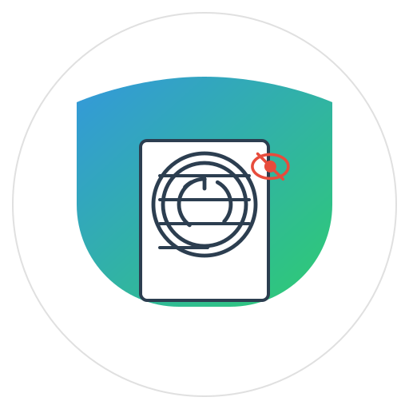

# PrivacyGuardian (WhisperPrint + Privacy-Guardian)

<p align="center">
  
</p>

A comprehensive data leakage prevention and tracing system that combines document fingerprinting with sensitive information detection across multiple file formats.

## 🚀 Hackathon Project

This project was developed for the [YourHackathonName] Hackathon, focusing on privacy and security solutions. PrivacyGuardian provides a comprehensive solution for:

1. **Document Fingerprinting**: Invisibly mark documents with recipient-specific fingerprints
2. **Leak Tracing**: Identify the source of leaked documents
3. **Privacy Protection**: Detect and prevent sharing of sensitive information

## ✨ Key Features

### Document Fingerprinting
- **Invisible Fingerprinting**: Embed invisible recipient-specific markers in documents using zero-width characters
- **Multi-Format Support**: Process text, PDF, Word, Excel, PowerPoint and other common document formats
- **Content Paraphrasing**: Create linguistically unique versions per recipient
- **Source Tracking**: Identify the exact source of leaked documents

### Privacy Protection
- **Sensitive Information Detection**: Identify PII, financial data, and other sensitive content
- **Multi-Format Scanning**: Check documents, spreadsheets, presentations, and more
- **Risk Scoring**: Get instant assessment of content sensitivity
- **Intelligent Recommendations**: Receive clear guidance on how to handle content

### Modern UI/UX
- **Drag & Drop Interface**: Easily upload files with visual feedback
- **Smooth Animations**: Enjoy a polished, responsive experience
- **Real-time Notifications**: Stay informed with elegant notification system
- **Mobile Responsive**: Use on any device with adaptive layout

## 🚀 Getting Started

### Prerequisites
- Python 3.8+
- Node.js 14+ (for running client)

### Installation

1. Clone the repository:
```bash
git clone https://github.com/AsukaFurukawa/PrivacyGuardian.git
cd PrivacyGuardian
```

2. Create a virtual environment and install dependencies:
```bash
python -m venv venv
source venv/bin/activate  # On Windows: venv\Scripts\activate
pip install -r requirements.txt
```

3. Download required models:
```bash
python -m spacy download en_core_web_md
```

4. Start the API server:
```bash
python run_server.py
```

5. Start the client application:
```bash
# On Windows
run_client.bat

# On macOS/Linux
cd client
python -m http.server 8080
# Then open http://localhost:8080 in your browser
```

## 📋 How It Works

### Fingerprinting Technology
PrivacyGuardian uses multiple techniques to fingerprint documents:

1. **Zero-Width Characters**: Invisible Unicode characters strategically embedded within text
2. **Linguistic Paraphrasing**: AI-powered rephrasing to create unique textual fingerprints
3. **Metadata Embedding**: Optional preservation of tracking information in document metadata
4. **Format-Specific Techniques**: Specialized methods for each file format

### Leak Tracing Process
When a suspected leak is detected:

1. Upload the document through the "Identify Leak" interface
2. The system extracts and analyzes any fingerprints
3. A confidence score and recipient details are provided
4. Document metadata is examined for additional confirmation

### Privacy Analysis
The privacy detection engine:

1. Scans documents for over 50 types of sensitive information
2. Uses machine learning and pattern matching
3. Calculates a risk score based on content sensitivity
4. Provides specific recommendations for handling the document

## 💻 Usage Guide

### Fingerprinting a Document
1. Go to the "Fingerprint Document" tab
2. Enter the recipient's email or identifier
3. Either paste text or upload a document
4. Click "Create Fingerprinted Document"
5. Download or copy the fingerprinted content

### Identifying a Leak Source
1. Navigate to the "Identify Leak" tab
2. Upload the suspected leaked document or paste its content
3. Click "Identify Source"
4. Review the identified recipient and confidence score

### Checking for Sensitive Information
1. Open the "Privacy Check" tab
2. Select the appropriate content type
3. Upload a file or paste content
4. Click "Check Content"
5. Review the risk score, recommendations, and detected items

## 🔐 Privacy & Security

PrivacyGuardian is designed with privacy in mind:

- All processing occurs locally on your server
- No data is sent to external services
- Document fingerprints are stored securely with encryption
- API access is protected with authentication

## 🛠️ Technical Architecture

- **Backend**: FastAPI + PyTorch + SQLite
- **Frontend**: HTML/CSS/JavaScript with modern animations
- **NLP Engine**: Transformer models for text analysis
- **Document Processing**: Custom parsers for multiple file formats

## 🔄 API Endpoints

| Endpoint | Description |
|----------|-------------|
| `/fingerprint` | Create fingerprinted text |
| `/fingerprint/file` | Create fingerprinted document |
| `/identify` | Identify source of leaked content |
| `/check` | Check content for sensitive information |
| `/stats` | Get usage statistics |

## 🤝 Contributing

Contributions are welcome! Please feel free to submit a Pull Request.

1. Fork the repository
2. Create your feature branch (`git checkout -b feature/amazing-feature`)
3. Commit your changes (`git commit -m 'Add some amazing feature'`)
4. Push to the branch (`git push origin feature/amazing-feature`)
5. Open a Pull Request

## 📄 License

This project is licensed under the MIT License - see the LICENSE file for details.

## 🙏 Acknowledgments

- [HuggingFace](https://huggingface.co/) for providing the transformer models
- [PyTorch](https://pytorch.org/) for the machine learning framework
- [FastAPI](https://fastapi.tiangolo.com/) for the API framework
- [Font Awesome](https://fontawesome.com/) for icons

## 🏗️ Project Structure

```
whisperprint/
├── api/                  # API implementation
│   └── main.py           # FastAPI entry point
├── whisperprint/         # Document fingerprinting module
│   ├── engine.py         # Core fingerprinting logic
│   └── database.py       # Database interactions
├── privacy_guardian/     # Privacy detection module
│   └── detector.py       # Sensitive information detection
├── client/               # Web client
│   ├── index.html        # Main HTML
│   ├── styles.css        # CSS styles
│   ├── client.js         # Client-side logic
│   └── assets/           # Images and resources
└── requirements.txt      # Python dependencies
```

## 🔜 Future Work

See the [Commercial Roadmap](commercial_roadmap.md) for the planned evolution of this project.

## 👥 Team

- [Prachi Sinha] (https://github.com/yourusername) - Role
- [Alekh Kumar] (https://github.com/username2) - Role
- [Tushar Kumar] (https://github.com/username3) - Role

## 🙏 Acknowledgments

- Thanks to the hackathon organizers
- All the open-source libraries that made this possible
- Special thanks to the HuggingFace team for their amazing NLP models 